# Network Forensic Analysis Report

## Time Thieves 
You must inspect your traffic capture to answer the following questions:

1. What is the domain name of the users' custom site?
    - Domain name - frank-n-ted.com
    - 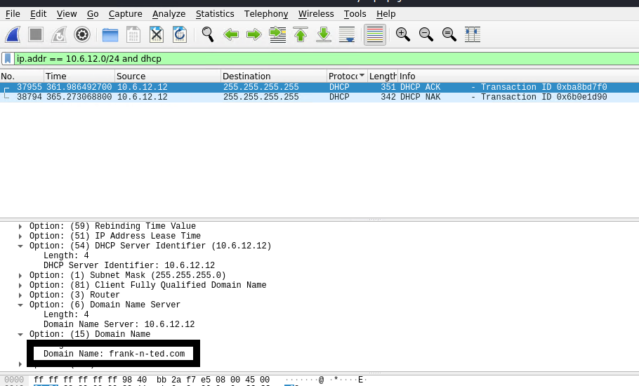
     
2. What is the IP address of the Domain Controller (DC) of the AD network?
    - IP - 10.6.12.12
    - 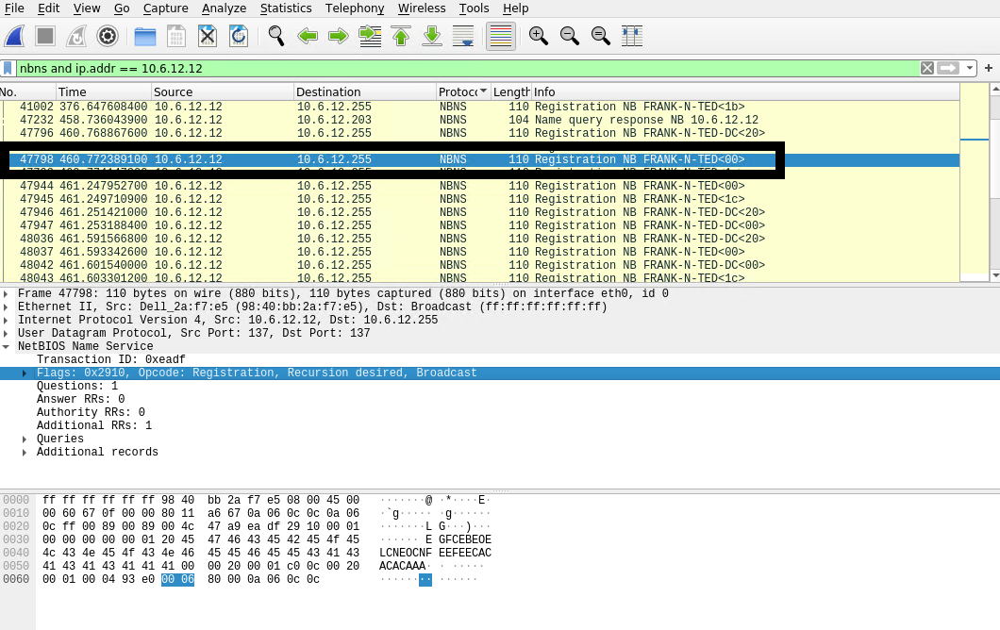
     
3. What is the name of the malware downloaded to the 10.6.12.203 machine?
    - Malware - june11.dll 
    - 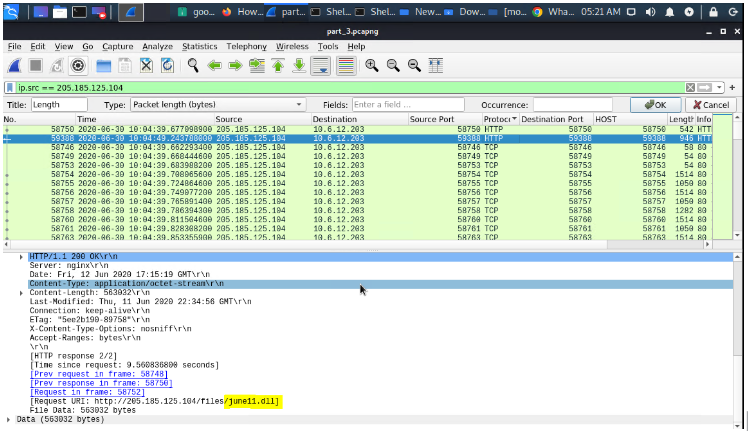
     
4. Upload the file to [VirusTotal.com](https://www.virustotal.com/gui/). 
    - 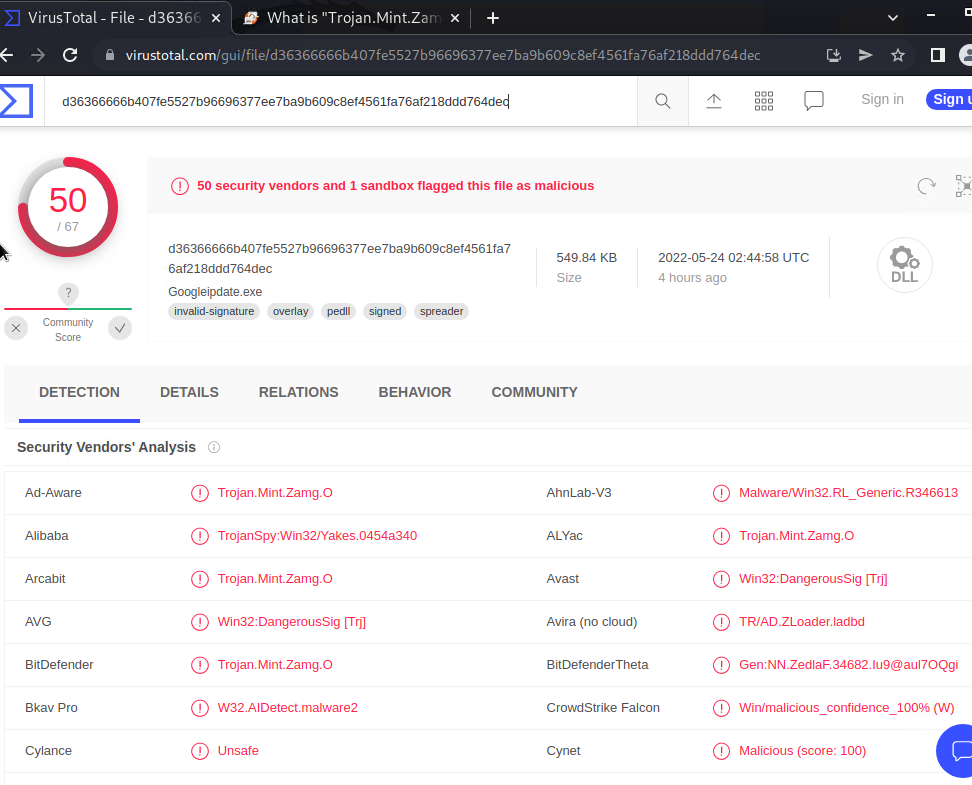
5. What kind of malware is this classified as?
    - Classification - Trojan.Mint.Zamg.Q (B)
 
---

## Vulnerable Windows Machine

1. Find the following information about the infected Windows machine:
    - Host name: Rotterdam-PC
    - IP address: 172.16.4.205
    - MAC address: 00:59:07:b0:63:a4
    - 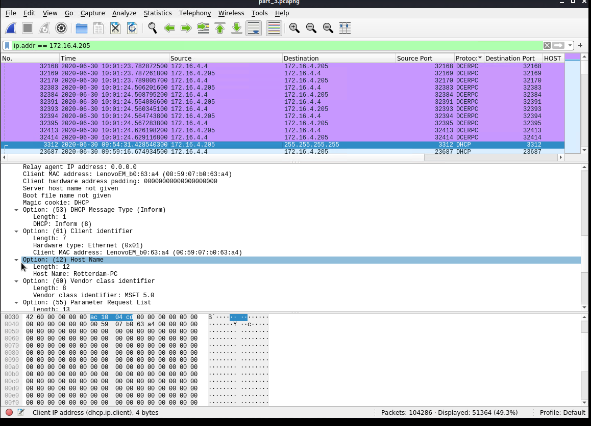
     
2. What is the username of the Windows user whose computer is infected?
    - Username: rotterdam-pc$
    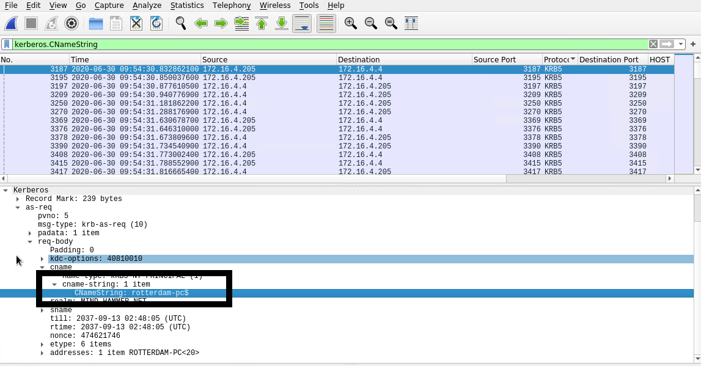
     
3. What are the IP addresses used in the actual infection traffic?
    - Victim 172.16.4.205 (Rotterdam-PC.mind-hsmmer.net)
    - Source 31.7.62.214 (http://31.7.62.214/fakeurl.htm)
    - 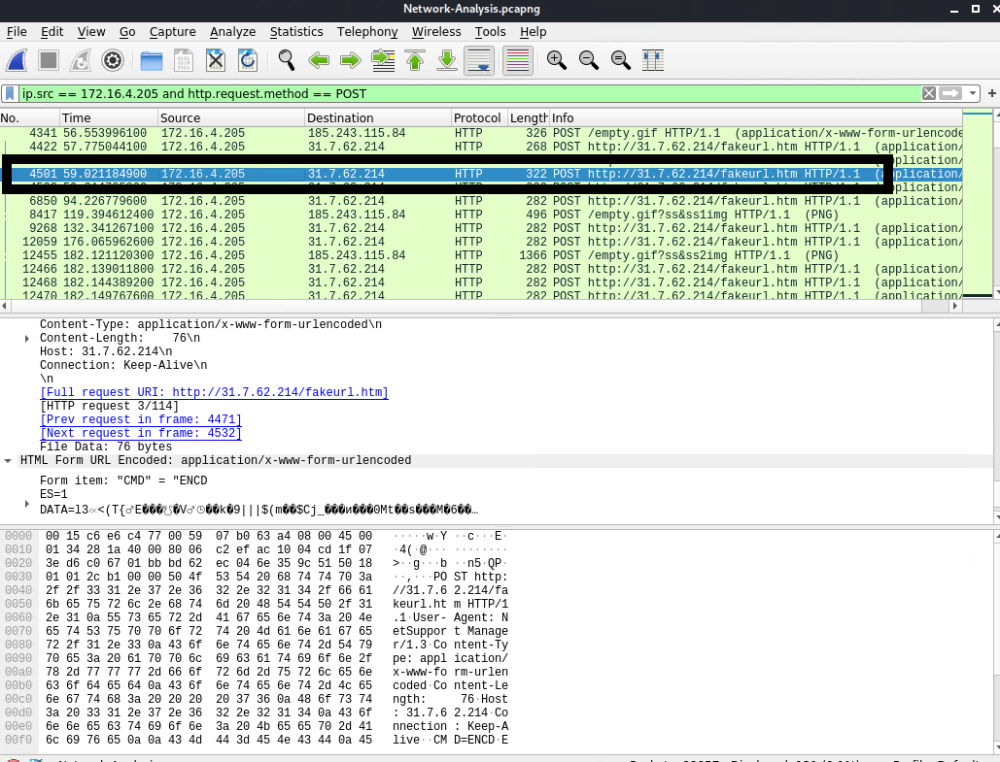
     
4. As a bonus, retrieve the desktop background of the Windows host.
    - 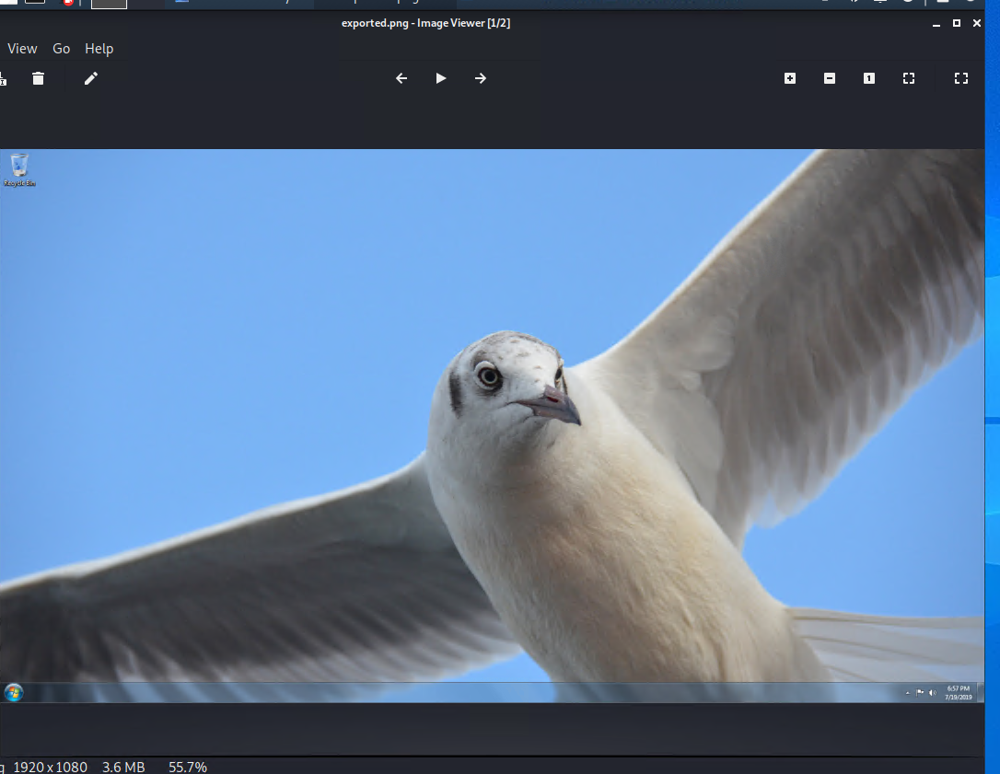
---

## Illegal Downloads

1. Find the following information about the machine with IP address `10.0.0.201`:
    - MAC address: 00:16:17:18:66:c8
    - 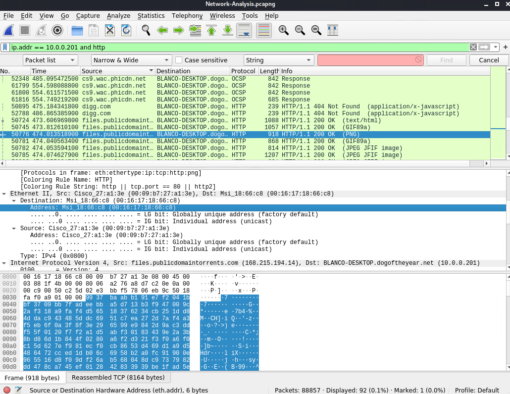
     
    - Windows username: elmer.blanco
    - 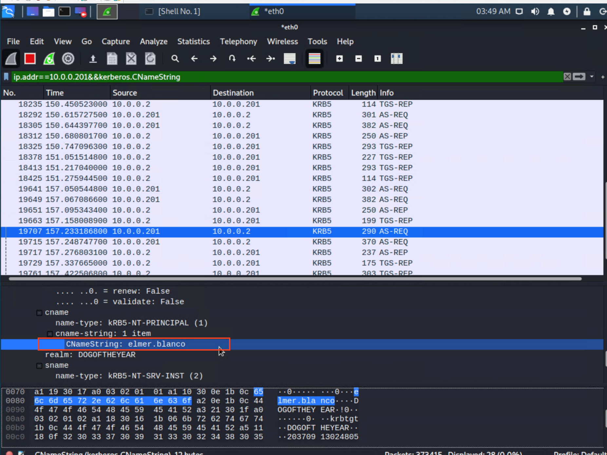
     
    - Computer host name: BLANCO-DESKTOP.dogoftheyear.net (10.0.0.201)
    - 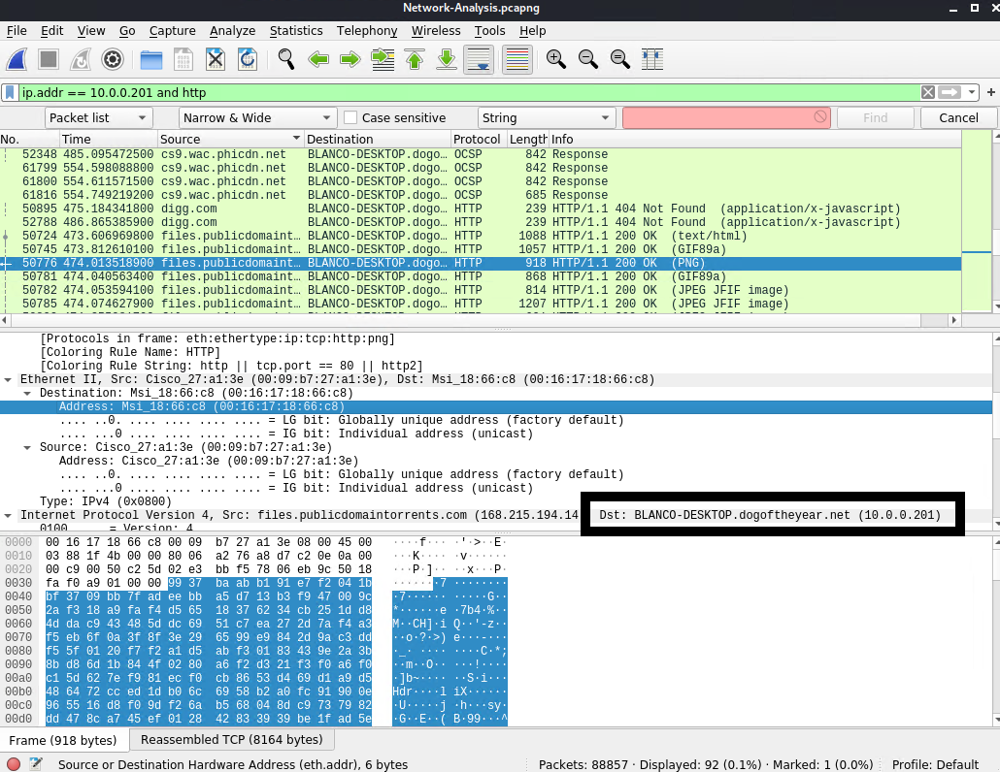
     
    - OS version: Mozilla/5.0 (Windows NT 10.0; Win64;) AppleWebKit/537.36 (KHTML, like Gecko) Chrome/64.0.3282.140 Safari/5
    - 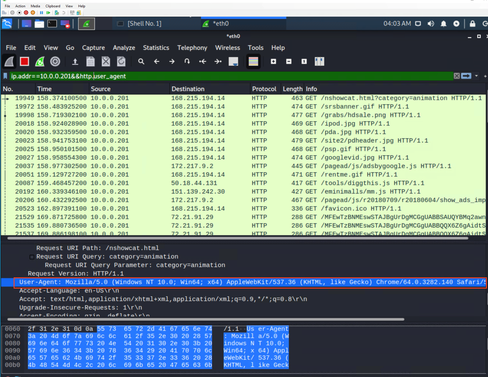

2. Which torrent file did the user download?
    - Betty_Boop_Rythm_on_the_Reservation.avi.torrent
    - 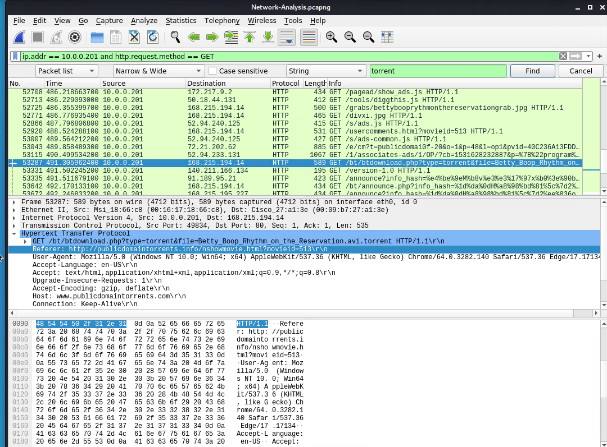
