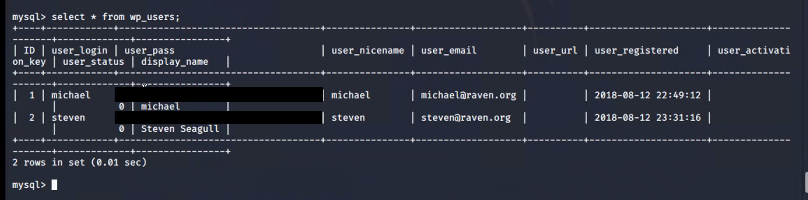

# Red Team: Summary of Operations

## Table of Contents
- Exposed Services
- Critical Vulnerabilities
- Exploitation

### Exposed Services

Nmap scan results for each machine reveal the below services and OS details:

`nmap -sV 192.168.1.0/24`

This scan identifies the services below as potential points of entry:
- **Target 1 (192.168.1.110)**
  - Port 22/tcp ssh
  - Port 80/tcp http
  - Port 111/tcp rpcbind
  - Port 139/tcp netbios-ssn
  - Port 445/tcp netbios-ssn

The following vulnerabilities were identified on each target:
- **Target 1**
  - Exposed ports/Network mapping
      - CWE-200  Severity: High
  - WordPress Enumeration 
      - CWE-284 Severity: High
  - Sensitive Data Exposure
      - CWE-200 Severity: High
  - Weak Passwords
      - CWE-521 Severity: Medium
  - Weak permissions: wp-config.php file
      - CWE-16 Severity: Medium
  - Privilege Escalation 
      - CVE-2022-1356 Severity: High 

 **Vulnerability scan**
  

### Exploitation
 
The Red Team was able to penetrate `Target 1` and retrieve the following confidential data:
 **Target 1**

 
  - ## `flag1.txt`: flag1{b9bbcb33e11b80be759c4e844862482d}
    - **Exploit Used**
    - **Method 1**
      - Veiw source code on `http://192.168.1.110//service.html` using *"ctrl+u"*.
      - 
     
    - **Method 2**
      - Used WPScan to enumerate users of the Target 1 WordPress site
      - `$ wpscan --url http://192.168.1.110/wordpress --enumerate u`
       -    |  
     
      - I decided to target the *michael* account first.
      - Gained access to the *michael* account using `ssh michael@192.168.1.110` and guessing the password.
       -  
     

      - After gaining access to the *michael* account, I traversed through the directories and files. Using `cd ../../` and `ls -al` to list files and then search for flags and other interesting data.
      - This is how I found Flag 1 in *var/www/html* folder. Uing the commands `cd var/www/html` and `ls -al` then  `cat flag1.txt` to get the Flag 1 hash.
       -  |  
     

  - ## `flag2.txt`: flag2{fc3fd58dcdad9ab23faca6e9a36e581c}
    - **Exploit Used**
      - While still using the *michael* account, Flag 2 was also found.
      - While traversing through directories and files, Flag 2 was found in the */var/www* directory next to the *html* directory that held Flag 1.
      - I used the command `cat flag2.txt` to get the Flag 2 hash.
          
   

  -  ## `flag3.txt` & `flag4.txt`: flag3{afc01ab56b50591e7dcc} & flag4{715dea6c055b9fe3337544932f2941ce}
    - **Exploit Used**
      - While looking through the dicectories using the *michael* account we discovered the `wp-config.php` file in the `/var/www/html/wordpress` directory.
      - 
   

      - In the `wp-config.php` file the credentials for a MySQL database were visible in plain text.
        
   

      - Using the credentials discovered in the `wp-config.php` file, I was able to gain access to the MySQL database.
        
   

      - Using the command `select * from wp posts;` I was able to discover and inspect the contents of the database. Here I discovered Flag 3 and Flag 4.
       -   | 
   

      - The data base also contained the `wp_users` table including usernames and hashed passwords.
      Using the command `select * from wp_users; > wp_hashes.txt` I extracted this data and copied it to the Kali attacking machine.
       - 
   

      - I then ended the ssh michael session and used the tool `John the Ripper` to crack the *steven* accounts password. 
      - Using the command `john wp_hashes.txt` the *steven* accounts password was successfully cracked.
       -   |  
   

      - Using the cracked hash and extracted account name *`steven`* I started an ssh session using the command `ssh steven@192.168.1.110`.
       - 
   

      - WHile doing reconnaissance on the *steven* account I used the command `sudo -l` to see if there were any sudo permissions that could be leveraged for privillege escalation. I found that the *steven* account had sudo permissions to run python scripts.
       - 
   

      - I was able to achieve a root shell by exploiting python via the command `sudo python -c ‘import pty;pty.spawn(“/bin/bash”)’`. This successfully gave me a root shell.
       - 
   

      - Using the root shell to traverse through the root directories and files Flag 4 was discovered in a second location.
      - Using `cd ../` and `ls -al` to list files and used the `find -iR flag | grep flag` command search for flags.
      - After finding where the Flag 4 duplicate was i moved to that directory using `cd /root` and `cat root/flag4.txt` to see the flag hash and the additoinal text found with it. 
       - .
      

 