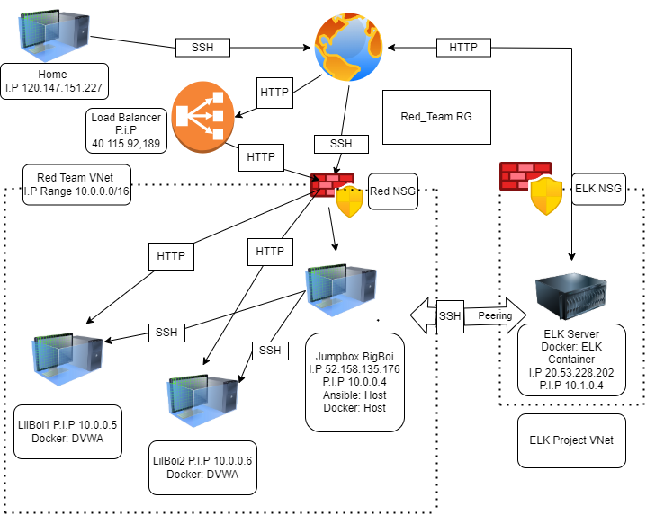

## Automated ELK Stack Deployment

The files in this repository were used to configure the network depicted below.

These files have been tested and used to generate a live ELK deployment on Azure. They can be used to either recreate the entire deployment pictured above. Alternatively, select portions of the **Ansible** file may be used to install only certain pieces of it, such as Filebeat.

This document contains the following details:
- Description of the Topologu
- Access Policies
- ELK Configuration
  - Beats in Use
  - Machines Being Monitored
- How to Use the Ansible Build

### Description of the Topology

The main purpose of this network is to expose a load-balanced and monitored instance of DVWA, the D*mn Vulnerable Web Application.

Load balancing ensures that the application will be highly **avaliable**, in addition to restricting **access** to the network.

Integrating an ELK server allows users to easily monitor the vulnerable VMs for changes to the **logs** and system **metrics and statistics**.

The configuration details of each machine may be found below.

| Name     | Function | IP Address | Operating System |
|----------|----------|------------|------------------|
| Jump Box BigBoi | Gateway  | 10.0.0.4 | Linux            |
| LilBoi-1 | Webserver | 10.0.0.5 | Linux                 |
| LilBoi-2 | Webserver | 10.0.0.6 | Linux                 |
| Elkserver | ELKstack | 10.1.0.4 | Linux                |

### Access Policies

The machines on the internal network are not exposed to the public Internet. 

Only the Jumpbox BigBoi machine can accept connections from the Internet. Access to this machine is only allowed from the following IP addresses: **121.200.4.250**

Machines within the network can only be accessed by **Jumpbox BigBoi, IP 10.0.0.4**.

A summary of the access policies in place can be found in the table below.

| Name     | Publicly Accessible | Allowed IP Addresses |
|----------|---------------------|----------------------|
| Jumpnbox BigBoi | No           | 121.200.4.250        |
| LilBoi-1 | Yes                 | 10.0.0.4, Any        |
| LilBoi-2 | Yes                 | 10.0.0.4, Any        |
| BigBalancer |  Yes             | Any                  |
| ELK Server | No                | 121.200.4.250        |

### Elk Configuration

Ansible was used to automate configuration of the ELK machine. No configuration was performed manually, which is advantageous because using a playbook you can quickly and easily stand up or rebuild a machine or machines. Using this method also means that all machines will be the same. 

The playbook implements the following tasks:
- 1. Install Docker
- 2. Install Python
- 3. Install Python Docket Package
- 4. Create ELK Container by downlaoding image
- 5. Expand Virtual memory for best preformance
- 6. Enable Docker service via Systemd

The following screenshot displays the result of running `docker ps` after successfully configuring the ELK instance.

### Target Machines & Beats
This ELK server is configured to monitor the following machines:
- Webserver Lil-Boi1 IP 10.0.0.5
- Webserver Lil-Boi2 IP 10.0.0.6

We have installed the following Beats on these machines:
- **Filebeat**
- **Metricbeat**

These Beats allow us to collect the following information from each machine:
- **Metricbeat** collects operating system metrics such as CPU or memory or data related to services.
- **Filebeat** monitors system logs or loactions you specify and uses that data to create log events.

### Using the Playbook
In order to use the playbook, you will need to have an Ansible control node already configured. Assuming you have such a control node provisioned: 

SSH into the control node and follow the steps below:
- Copy the **install-elk.yml** file to **/etc/ansible/**.
- Update the **/etc/ansible/hosts** file to include the **[elk] group** and specify the new elk machines IP, then specify elk in the Hosts line of your playbook. 
- Run the playbook, and navigate to **http://your-IP:5601/app/kibana#/home?_g=()** to check that the installation worked as expected.
